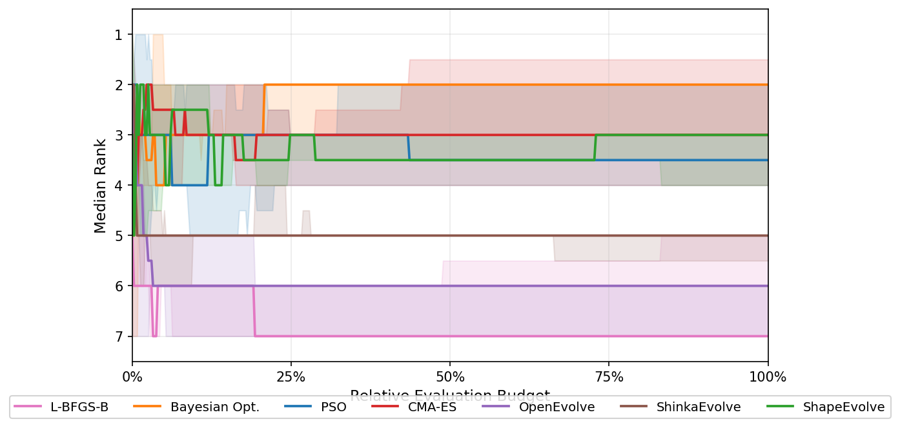

# ShapeBench



**ShapeBench** is an open benchmark for aerodynamic shape optimization (ASO), comprising **103 tasks** across 8 environments, 3 geometry classes, and 7 optimization methods.

---

## Benchmark Overview

| Stat | Value |
|---|---|
| Total tasks | 103 |
| Environments | 8 |
| Geometry types | 2D airfoil · 3D wing · BWB aircraft · automotive · supersonic transport · drone |
| Surrogate types | Neural network · VLM · FAST-OAD |
| High-fidelity solvers | Flow360 · FEniCS · VortexNet CFD |
| Optimization methods | 7 |

---

## Environments

### 2D Aerodynamics

#### NeuralFoil — 2D Airfoil
- **Geometry:** Kulfan CST parameterized airfoils (continuous parameter space)
- **Solver:** [NeuralFoil](https://github.com/peterdsharpe/NeuralFoil) — neural surrogate for 2D panel method aerodynamics
- **Tasks (~30):** L/D ratio optimization across Mach numbers, Reynolds numbers, and AoA; constrained lift/drag; glider endurance; multipoint robustness; HPA (human-powered aircraft) objectives
- **High fidelity:** XFoil validation; FEniCS 2D Navier-Stokes (`environments/fenics_2d`)

---

### 3D Wing Aerodynamics

#### SuperWing — Transonic 3D Wing
- **Geometry:** 38-parameter wing (Kulfan CST upper/lower surface coefficients, twist, sweep, dihedral, chord distribution)
- **Solver:** ATsurf_M (`WingPDETransformer`, HuggingFace `yunplus/AeroTransformer`) — neural surrogate for transonic wing aerodynamics; returns CL, CD, CM, L/D
- **Tasks (30):** L/D optimization across 30 benchmark cases spanning Mach 0.7–0.9 and varying AoA, with multipoint and range objectives
- **High fidelity:** SU2 / CFD pipeline (`environments/SuperWing/high_fidelity`)

#### VortexNet — Delta Wing (Subsonic/Supersonic)
- **Geometry:** Delta wing parametrized by sweep, twist, and NACA section
- **Solver:** VortexNet — multi-fidelity VLM neural network trained on delta wing dataset; returns CL, CD, CM, Kn
- **Tasks (~9):** Single-point and multipoint L/D, min CD with CL constraints, Kn optimization, subsonic/supersonic sweep
- **High fidelity:** Panel method + CFD (`environments/vortexnet/high_fidelity_cfd`)

#### SuperSonic Transport Aircraft — VLM-based Transport
- **Geometry:** Supersonic transport configuration parameterized via VLM planform variables
- **Solver:** VLM (Vortex Lattice Method) — run for 80 iterations per evaluation
- **Tasks (~21):** Single-point L/D at multiple Mach/AoA combinations (M1.2–1.8), multipoint drag reduction, constrained L/D with CL floors, subsonic cruise objectives
- **Note:** VLM capped at 80 iterations per call to benchmark method comparison while limiting exploitation of the VLM model

---

### Aircraft / Full Configuration

#### BlendedNet — Blended Wing Body (BWB)
- **Geometry:** Full BWB aircraft configuration with wing, center-body, and control surface parameters
- **Solver:** BlendedNet — neural surrogate for BWB aerodynamics; returns CL, CD, L/D, range
- **Tasks (~11):** Multipoint Mach CD, range optimization, static margin constrained, shapebench cases 5 & 6, total drag decomposition

#### CERAS — Commercial Aircraft
- **Geometry:** CERAS (Common European Research Aircraft) reference configuration
- **Solver:** [FAST-OAD](https://fast-oad.readthedocs.io/) — multidisciplinary aircraft sizing and performance tool
- **Tasks (1):** Fuel mass minimization

#### CCA Drone
- **Geometry:** CCA (Close-Coupled Actuator) drone airframe configuration
- **Solver:** Aerodynamic surrogate
- **Tasks (1):** L/D ratio maximization

---

### Automotive Aerodynamics

#### DrivAer Star — Automotive Exterior
- **Geometry:** DrivAer reference vehicle in three body variants — Notchback (vtk_N), Fastback (vtk_F), Estate (vtk_E) — parameterized surface morphing on VTK meshes
- **Solver:** ML surrogate trained on Flow360 RANS simulations; returns CD, CL
- **Tasks (~13):** CD minimization (standard, tight bounds, GC-constrained), CD+CL constrained, downforce efficiency — across all three body variants
- **High fidelity:** Flow360 RANS (`environments/High_Fidelity`)

---

## Optimization Methods

ShapeBench evaluates **7 methods**, covering classical numerical optimizers, evolutionary algorithms, and LLM-driven approaches.

| Method | Type | Description |
|---|---|---|
| **ShapeEvolve** | LLM-based | Island-model LLM evolutionary optimizer with dynamic optimizer generation, reflection, and scratchpad. LLM proposes and refines designs via structured XML prompts. See `frameworks/ShapeEvolve/` |
| **BO** | Classical | Bayesian Optimization — Gaussian Process surrogate with Expected Improvement acquisition (BoTorch). See `frameworks/BO_torch/` |
| **CMA-ES** | Classical | Covariance Matrix Adaptation Evolution Strategy — derivative-free optimizer well-suited to continuous parameter spaces. See `frameworks/cmaes/` |
| **GA** | Classical | Genetic Algorithm / Particle Swarm Optimization — population-based search with crossover and mutation. See `frameworks/GA/` |
| **L-BFGS-B** | Classical | Limited-memory BFGS with box constraints — quasi-Newton gradient-free closure. See `frameworks/lbfgsb/` |
| **OpenEvolve adapter** | LLM-based | [OpenEvolve](https://github.com/codelion/optillm) MAP-Elites + LLM — LLM proposes full parameter rewrites with diversity-promoting feature grid. See `frameworks/openevolve_adapter/` |
| **ShinkaEvolve adapter** | LLM-based | [ShinkaEvolve](https://github.com/Shinka-AI/ShinkaEvolve) LLM optimizer — alternative LLM-based search strategy. See `frameworks/shinka_adapter/` |

---

## Repository Structure

```
ShapeBench/
├── environments/          # Environment definitions (geometry + solver + rewards)
│   ├── NeuralFoil/        # 2D airfoil surrogate
│   ├── SuperWing/         # 3D transonic wing (ATsurf_M)
│   ├── BlendedNet/        # Blended wing body (BlendedNet)
│   ├── DrivAer_Star/      # Automotive (DrivAer*, OpenFOAM)
│   ├── CERAS/             # Commercial aircraft (FAST-OAD)
│   ├── CCA_drone/         # CCA drone
│   ├── vortexnet/         # Delta wing (VortexNet VLM)
│   ├── vlm_3d/            # Supersonic transport (VLM)
│   ├── High_Fidelity/     # High-fidelity CFD wrappers
│   └── fenics_2d/         # FEniCS 2D Navier-Stokes
├── frameworks/            # Optimization method implementations
│   ├── ShapeEvolve/       # LLM island optimizer (main method)
│   ├── BO_torch/          # Bayesian optimization (BoTorch)
│   ├── cmaes/             # CMA-ES
│   ├── GA/                # Genetic algorithm / PSO
│   ├── lbfgsb/            # L-BFGS-B
│   ├── openevolve_adapter/# OpenEvolve adapter
│   └── shinka_adapter/    # ShinkaEvolve adapter
├── best_rewards/          # Collected best results per task
└── run_benchmark.py       # Main entry point
```

---

## Running a Benchmark

```bash
# Single task
python run_benchmark.py \
  --framework ShapeEvolve \
  --environment SuperWing \
  --reward ld_ratio \
  --mach 0.86 --aoa 4.85 \
  --iterations 100 \
  --output-dir results/sw001

# All 30 SuperWing cases
python run_benchmark_samples.py --framework ShapeEvolve --iterations 100
```

All frameworks write standard output to `output_dir/`:
- `results.csv` — `iteration, design, reward, best_reward`
- `results.json` — full design database with metrics and images
- `design_<i>/` — per-iteration case directories
