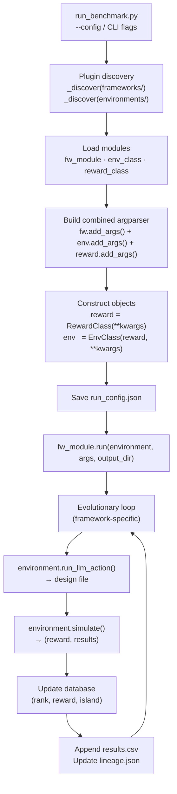

# ShapeEvolve

ShapeEvolve is a benchmark for **LLM-guided aerodynamic shape optimisation**. A large language model acts as a design agent, proposing new geometry parameters at each iteration. The proposed design is simulated by a physics solver (surrogate network or full PDE solver), a scalar reward is computed, and the result is fed back into the LLM's context for the next proposal. Multiple evolutionary frameworks control how the agent explores the design space, how designs are ranked, and how multiple parallel sub-populations exchange information.

The system is designed as a plugin architecture: frameworks, environments, and reward functions are discovered automatically from the filesystem, and new benchmarks can be added by creating a single folder.

---

## Repository layout

```
ShapeEvolve/
├── run_benchmark.py              # Unified CLI entry point
├── configs/                      # Pre-built JSON run configurations
│   ├── blended_net_3d.json
│   ├── blended_net_3d_islands.json
│   └── drivaer_star_3d_islands_800.json
│
├── environments/                 # Simulation environments (plug-in)
│   ├── base.py                   # BaseEnvironment abstract interface
│   ├── base_reward.py            # BaseReward abstract interface
│   ├── NeuralFoil/               # 2D airfoil — NeuralFoil NN surrogate
│   ├── BlendedNet/               # 3D blended-wing-body — Transolver GNN
│   ├── fenics_2d/                # 2D Navier-Stokes — FEniCS PDE solver
│   ├── vlm_3d/                   # 3D delta wing — SUAVE VLM + VortexNet
│   └── DrivAer_Star/             # 3D automotive — Transolver GNN
│
├── frameworks/                   # Evolutionary frameworks (plug-in)
│   ├── core/                     # Shared primitives: database, sampling, migration, lineage
│   ├── islands/                  # Base island-model LLM evolution
│   ├── v2/                       # islands + persistent scratchpad + reflection
│   ├── v2_batch/                 # v2 + batch Gaussian sampling per LLM call
│   └── GA/                       # Particle Swarm Optimisation (no LLM)
│
├── Test_Time_Discovery/          # Online RL training of the LLM during optimisation
│   ├── run_discovery.py          # TTD entry point
│   ├── training/                 # Tinker backend, ShapeEvolve env adapter, state sampler
│   └── configs/                  # TTD-specific run configs
│
├── analysis/                     # Post-processing and animation scripts
├── scripts/                      # Delta-wing geometry and VLM utilities
└── MF-VortexNet/                 # Multi-fidelity VortexNet GNN (used by vlm_3d)
```

---

## Quick start

### 1. API key

Create a `.env` file in the repository root (or export the variable):

```bash
GOOGLE_API_KEY=your_gemini_key_here
```

### 2. Dependencies

Install the Python requirements for the environments you intend to run. At minimum:

```bash
pip install google-generativeai aerosandbox neuralfoil numpy pandas matplotlib networkx
```

Additional per-environment dependencies are listed in each environment's folder.

**SuperWing** requires `cfdpost` (from GitHub for the `wing` submodule) and `flowvae` (the `floGen` library):

```bash
pip install --no-deps git+https://github.com/YangYunjia/cfdpost.git
pip install git+https://github.com/YangYunjia/floGen.git
```

`cfdpost` also has a one-line bug in `multi_section_wing.py` that must be patched after install: in `_reconstruct_surface_grids`, change `yus[:-1]` → `yus` on the line that builds `zzs` in the `rtcs` branch (line ~212). The ATsurf_M model weights are downloaded automatically from `yunplus/AeroTransformer` on first run.

### 3. Run a benchmark

```bash
# Using a pre-built config
python run_benchmark.py --config configs/blended_net_3d_islands.json

# Fully via CLI (overrides any config key)
python run_benchmark.py \
  --framework islands \
  --environment NeuralFoil \
  --reward ld_ratio \
  --iterations 200 \
  --num_islands 3 \
  --debug
```

Results are written to `environments/<env>/results/run_<framework>_<reward>/` by default,
or to the directory specified by `--output-dir`.

---

## System architecture

### End-to-end flow



### Plugin discovery

`run_benchmark.py` scans `frameworks/` and `environments/` at startup. A folder is recognised as a **framework** if it contains `__init__.py` and `run.py`; as an **environment** if it contains `__init__.py` and `environment.py`. Reward modules are discovered from `environments/<env>/rewards/*.py`. No registration is required — adding a new folder is sufficient.

### `BaseEnvironment` interface

Every environment must extend `environments/base.py:BaseEnvironment` and implement:

| Method | Purpose |
|---|---|
| `simulate(design_path, case_dir)` | Run solver → return `(reward: float, results: dict)` |
| `build_context_entry(db_row)` | Convert a database row into an LLM context dict |
| `get_prompt_blocks()` | Return `format_context` and `format_response_instructions` callables |
| `run_llm_action(action, context, output_dir, name, ...)` | LLM call → write design file → return path |

Optional methods used by specific frameworks:

| Method | Used by |
|---|---|
| `sample_gaussian(mean_params, output_dir, name, std_scale)` | `v2_batch` |
| `get_reflection_inputs(design_path, case_dir)` | `v2`, `v2_batch` |
| `get_param_bounds()` / `write_design(x, ...)` | `GA` (PSO) |
| `set_llm_backend(backend, image_analyzer)` | Test-Time Discovery |
| `add_args(parser)` | All frameworks (static method) |

The `results` dict returned by `simulate()` must contain:

```python
{
    'metrics':  { ... },      # env-specific scalar values
    'images':   [ ... ],      # paths to output images shown to the LLM
    'feedback': "..."         # qualitative text fed back to the LLM
}
```

---

## Environments

### NeuralFoil — 2D airfoil aerodynamics

**Physical problem:** Steady-state 2D aerodynamic shape optimisation of a lifting airfoil. The agent controls the full surface shape and can target maximum L/D, maximum lift, pitch-moment constraints, or a multi-point human-powered aircraft (HPA) design problem.

**Simulator:** [NeuralFoil](https://github.com/peterdsharpe/NeuralFoil) — a neural-network surrogate for XFoil. Geometry is represented by the Kulfan CST parameterisation via AeroSandbox (`asb.KulfanAirfoil`). No external mesh is generated; inference is fully in-process.

**Geometry:** 18 scalar Kulfan weights are decoded directly into airfoil surface coordinates by AeroSandbox.

**Design space (18 parameters):**

| Parameter | Count | Bounds | Description |
|---|---|---|---|
| `upper_weights` | 8 | (−0.30, 0.60) | Upper-surface CST coefficients |
| `lower_weights` | 8 | (−0.30, 0.30) | Lower-surface CST coefficients |
| `leading_edge_weight` | 1 | (−0.50, 0.50) | Leading-edge modification weight |
| `TE_thickness` | 1 | (0.000, 0.010) | Trailing-edge thickness (chord fraction) |

Default baseline ≈ NACA 4412. Gaussian std fractions: 12 % for surface weights, 10 % for leading-edge weight, 15 % for trailing-edge thickness.

**Outputs per evaluation:** `CL`, `CD`, `CM`, `Top_Xtr` (upper transition location), `Bot_Xtr` (lower transition location), `analysis_confidence`, plus `shape.png`.

**Reward functions** (set via `--reward`):

**`ld_ratio`** — Maximise lift-to-drag ratio at α = 5°, Re = 1 × 10⁶:

```
reward = CL / CD          (FAIL_REWARD = −5.0 if CD ≤ 1×10⁻⁹)
```

**`constrained_ld`** — L/D with pitch-moment penalty (flying-wing / reflex sections):

```
LD     = CL / CD
reward = LD − w_cm × (CM − cm_target)²
         (defaults: w_cm = 10, cm_target = 0)
```

**`max_cl`** — Maximise lift coefficient at α = 10°:

```
reward = CL − w_cd × CD    (default w_cd = 0)
```

**`multipoint_hpa`** — Full human-powered aircraft multi-point optimisation. Six CL targets `[0.8, 1.0, 1.2, 1.4, 1.5, 1.6]` are evaluated with weights `[5, 6, 7, 8, 9, 10]`. Reynolds number follows Drela's schedule: `Re = 500 000 × (CL / 1.25)^−0.5`. Alpha is solved for each target CL via Brent's method bisection.

```
reward = F_objective + F_penalty

# Objective (sign-flipped):
F_objective = − weighted_mean(CD_i × weight_i)   over solved operating points

# Constraint penalties (normalised violations):
F_penalty = −Σ λ_k × p_k
```

Constraint violations `p_k` enforced:
- Local surface thickness > 0 everywhere (no self-intersection)
- Thickness at 33 % chord ≥ 0.128
- Thickness at 90 % chord ≥ 0.014
- Trailing-edge angle ≥ 6.03°
- `upper_weights[0] > 0.05`
- `lower_weights[0] < −0.05`
- Wiggliness < 2 × NACA0012 wiggliness
- `CM_i ≥ −0.133` at every operating point
- `analysis_confidence > 0.90` at every operating point
- Alpha monotonically increasing with CL
- Penalty per unreachable CL target

Fail reward: −10.0.

---

### BlendedNet — 3D blended-wing-body aerodynamics

**Physical problem:** 3D aerodynamics of a blended-wing-body (BWB) aircraft planform. Objective: maximise an approximate lift-to-drag ratio.

**Simulator:** Transolver GNN surrogate (`transolver_best.pt`) — a transformer-based operator network trained on BWB CFD data. Takes 8 192 subsampled surface mesh points as input, with 15 channels per point `[B1, B2, B3, C2, C3, C4, S1, S2, S3, log10(Re), Mach, alpha, normal_x, normal_y, normal_z]`. Outputs 3 channels per point: `Cp`, `Cfx`, `Cfz`.

**Geometry generation:** 9 planform parameters are passed to an OpenVSP script (run under a `conda` sub-environment). OpenVSP modifies a base `model.vsp3` template and exports an STL. PyVista reads the STL and 8 192 points are randomly subsampled for inference.

**Design space (9 planform parameters + 3 fixed flight conditions):**

| Parameter | Bounds | Description |
|---|---|---|
| `B1` | [100, 200] mm | Body/span dimension 1 |
| `B2` | [50, 200] mm | Body/span dimension 2 |
| `B3` | [200, 700] mm | Body/span dimension 3 |
| `C2` | [550, 850] mm | Chord at section 2 |
| `C3` | [180, 280] mm | Chord at section 3 |
| `C4` | [60, 90] mm | Chord at section 4 |
| `S1` | [40, 60] mm | Sweep/shape parameter 1 |
| `S2` | [40, 60] mm | Sweep/shape parameter 2 |
| `S3` | [24, 40] mm | Sweep/shape parameter 3 |

Flight conditions (passed as CLI flags `--re`, `--mach`, `--alpha`): defaults Re = 1×10⁷, Mach = 0.3, α = 4°.

**Outputs per evaluation:** `Cp_mean`, `Cfx_mean`, `Cfz_mean` plus images `Cp_iso.png`, `Cp_top.png`, `Cfx_iso.png`, `Cfx_top.png`.

**Reward function** (`ld_ratio`):

```
CL_approx = −Cp_mean       # negative mean surface pressure → lift proxy
CD_approx =  Cfx_mean      # mean streamwise friction → drag proxy
reward    =  CL_approx / CD_approx    (FAIL_REWARD = −5.0)
```

---

### fenics_2d — 2D incompressible Navier-Stokes shape optimisation

**Physical problem:** 2D unsteady incompressible Navier-Stokes flow around a closed deformable shape. Starting from a cylinder, the agent modifies B-spline control points to maximise lift / |drag|.

**Simulator:** FEniCS PDE solver (`fenics_solver.py::solve_flow()`). A 2D triangular mesh is built by pygmsh/meshio for each proposed shape. FEniCS integrates until `final_time` with CFL-based adaptive time-stepping. Outputs VTK and PNG flow-field snapshots.

**Geometry generation:** The action vector is decoded into displacements for `nb_pts_to_move` control points. Each point has three degrees of freedom:

```
action[i, 0]: radius param  → radius = max(|val|, 0.2) × max_deformation
action[i, 1]: angle perturb → angle  = base_angle + val × (dangle / 2)
action[i, 2]: edgy param    → edgy   = 0.5 + 0.5 × |val|
```

Values are in `[−1, 1]` and stored as a flat comma-separated CSV file. Meshes that exceed `cell_limit` triangles are rejected.

**Observation / state:** For each control point `i` of the full shape: `[x_i, y_i, edgy_i]`. Plus drag/lift scalars and PNG flow-field images.

**Reward function** (`default`):

```python
lift = -lift       # FEniCS sign convention

if lift > 2.0:
    lift = 2.0 * lift    # shaping boost for fast convergence

reward = lift / abs(drag)
reward = max(reward, -10.0)

# Fail (mesh or solver failure):
reward = -5.0
```

---

### vlm_3d — 3D delta-wing aerodynamics (two-point)

**Physical problem:** 3D delta-wing multi-objective optimisation: minimise supersonic induced drag while meeting lift, trim (CM = 0), and static stability targets at both a supersonic cruise point and a subsonic manoeuvre point.

**Simulator:** Two-stage pipeline in `scripts/generate_design_corrected.py`:
1. SUAVE Vortex Lattice Method (VLM) for baseline aerodynamics
2. VortexNet GNN (`MF-VortexNet`, `hidden_channels = 63, HEADS = 4, HOP = 10`) predicts per-panel ΔCp corrections to the VLM solution

Each evaluation runs three SUAVE calls: supersonic (Mach = 1.8, Re = 80.4 × 10⁶), subsonic (Mach = 0.3, Re = 101.8 × 10⁶), and subsonic + δα for the static margin finite difference.

**Geometry:** Analytically parameterised inside SUAVE — no external mesher. NACA 4-digit sections are specified per wing. A geometry PNG is saved with VLM panel Cp colour map.

**Design space (8 parameters):**

| Parameter | Type | Bounds | Description |
|---|---|---|---|
| `le_sweep` | continuous | [45°, 80°] | Leading-edge sweep angle |
| `root_chord_in` | continuous | [10, 50] in | Root chord length |
| `twist_root` | continuous | [−10°, 10°] | Twist at wing root |
| `twist_tip` | continuous | [−10°, 10°] | Twist at wing tip |
| `dihedral` | continuous | [−15°, 15°] | Wing dihedral |
| `naca_m` | discrete | {0, 2, 4} | NACA max camber × 100 |
| `naca_p` | discrete | {0, 4} | NACA camber position × 10 |
| `naca_t` | integer | [6, 24] | NACA thickness × 100 |

**Outputs per evaluation:** `CL_sup`, `CDi_sup`, `CM_sup` (supersonic), `CL_sub`, `CDi_sub`, `CM_sub` (subsonic), `Kn` (static margin), plus geometry image.

**Reward function** (`two_pt_multi`):

Static margin from finite differences:
```
CL_alpha = (CL(α + δα) − CL(α)) / δα    (δα = 0.01°)
CM_alpha = (CM(α + δα) − CM(α)) / δα
Kn       = −CM_alpha / CL_alpha
```

Reward:
```
reward  = −CDi_sup                                     # minimise supersonic induced drag
reward −= w_cl × (CL_sup − 0.1665)²                   # supersonic CL target (w_cl = 10)
reward −= w_cl × (CL_sub − 0.6933)²                   # subsonic CL target   (w_cl = 10)
reward −= w_cm × CM_sup²                               # supersonic trim       (w_cm = 100)
reward −= w_cm × CM_sub²                               # subsonic trim         (w_cm = 100)
if Kn < 0.05:
    reward −= w_kn × (0.05 − Kn)²                     # static margin ≥ 5 %  (w_kn = 100)

FAIL_REWARD = −5.0
```

---

### DrivAer_Star — 3D full-car aerodynamics

**Physical problem:** Full 3D automotive aerodynamics of the DrivAerStar sedan reference geometry. Objective: minimise drag coefficient Cd.

**Simulator:** Transolver GNN surrogate (`transolver_best.pt`) trained on DrivAerStar CFD data. Architecture: `space_dim = 7, n_layers = 4, n_hidden = 64, n_head = 4, out_dim = 4, slice_num = 16`. Input per surface cell: `[cx, cy, cz, area, nx, ny, nz]`. Output: `[pressure, wss_x, wss_y, wss_z]`. Forces are integrated from the predicted fields:

```python
drag = Σ(pressure × area × nx)  +  Σ(wss_x × area)
lift = Σ(pressure × area × nz)  +  Σ(wss_z × area)
```

**Geometry generation:** Pure-NumPy Free-Form Deformation (FFD) applied to a base VTK mesh (`data/vtk_E/00000.vtk`). 20 parametric deformations are applied sequentially; each uses sigmoid-based regional masking to limit influence to the correct body region. PyVista recomputes cell areas and normals after deformation. No external mesher is required.

**Design space (20 FFD parameters):**

| Parameter | Bounds | Body region |
|---|---|---|
| `car_size` | [0.8, 1.2] | Global uniform scale |
| `car_width` | [−0.10, 0.10] m | Body width |
| `car_len` | [−0.10, 0.10] m | Body length |
| `ramp_angle` | [−8°, 8°] | Front underbody ramp |
| `front_bumper_length` | [−0.10, 0.10] m | Front bumper extension |
| `wind_screen_x/z` | [−0.05, 0.05] m | Windshield x / z position |
| `side_mirrors_x/z` | [−0.05, 0.05] m | Side mirror x / z position |
| `rear_window_x/z` | [−0.05, 0.05] m | Rear window x / z position |
| `trunklid_angle` | [−8°, 8°] | Trunk lid angle |
| `trunklid_x/z` | [−0.05, 0.05] m | Trunk lid x / z position |
| `diffusor_angle` | [−8°, 8°] | Rear diffuser angle |
| `car_green_house_angle` | [−8°, 8°] | Greenhouse (upper body) flare |
| `car_front_hood_angle` | [−8°, 8°] | Front hood angle |
| `car_air_intake_angle` | [−8°, 8°] | Air intake angle |
| `tires_diameter` | [−0.013, 0.013] m | Tire diameter offset |
| `tires_width` | [−0.015, 0.015] m | Tire width offset |

**Outputs per evaluation:** `drag`, `Cd`, `lift`, `drag_pressure`, `drag_shear`, plus six images (`Pressure_iso`, `Pressure_top`, `Pressure_side`, `WSSx_iso`, `WSSx_top`, `WSSx_side`).

**Reward function** (`cd_only`):

```
q    = 0.5 × ρ × u²     (ρ = 1.25 kg/m³, u = 40.0 m/s  →  q = 1 000 Pa)
Cd   = drag / (q × A_ref)              (A_ref = 2.37 m²)
reward = −Cd                           (FAIL_REWARD = −5.0)
```

---

### Environment summary

| Environment | Physical problem | Simulator | Design parameters | Primary reward |
|---|---|---|---|---|
| `NeuralFoil` | 2D airfoil aero | NeuralFoil NN surrogate | 18 CST weights | `CL/CD` (or HPA multipoint) |
| `BlendedNet` | 3D BWB aero | Transolver GNN (3-channel) | 9 planform params | `−Cp_mean / Cfx_mean` |
| `fenics_2d` | 2D N-S shape opt | FEniCS PDE solver | N × 3 control-point DOFs | `lift / \|drag\|` |
| `vlm_3d` | 3D delta wing | SUAVE VLM + VortexNet | 8 params | `−CDi_sup − penalties` |
| `DrivAer_Star` | 3D automotive aero | Transolver GNN (4-channel) | 20 FFD params | `−Cd` |

---

## Frameworks

### Core primitives (`frameworks/core/`)

All LLM frameworks share the same database, sampling, migration, and lineage utilities.

**Database** (`database.py`) — a NumPy object array with 5 columns per row:

| Column | Type | Content |
|---|---|---|
| 0 | `str` | Design file path |
| 1 | `int` | Rank (0 = best) |
| 2 | `float` | Reward |
| 3 | `dict` | Full results dict (`metrics`, `images`, `feedback`) |
| 4 | `int` | Island index |

`update_database()` appends a new entry and immediately re-sorts by reward descending, re-assigning ranks 0…N−1.

**Power-law rank sampling** (`sampling.py`) — selection probability is proportional to rank^(−α):

```
P(rank_i) ∝ rank_i^(−α)      (rank 0 = best, rank N−1 = worst)
```

Higher `α` (default 3.0) concentrates selection towards top-ranked designs. Three sampling functions are provided:
- `powerlaw_sample_parent_and_inspiration()` — single-population: returns one parent + up to N inspirations sampled without replacement.
- `powerlaw_sample_parent_from_island()` — same but restricted to one island.
- `sample_inspirations_from_island()` — structured: always includes the island's best design, fills up to `elite_ratio × n` from the next-best designs, then random fill.

**Migration** (`migration.py`) — `perform_migration(database, num_islands, migration_rate)`:
- The best design per island is protected and never migrates.
- A random fraction (`migration_rate × island_size`) of the remaining designs are reassigned to a randomly chosen other island.

**Lineage graph** (`lineage.py`) — a `networkx.DiGraph` visualised at each iteration. Nodes are coloured by reward (viridis), bordered by island colour, best node shown as a gold star. The path from root to current best is highlighted.

---

### `islands` — base island-model LLM evolution

The core evolutionary loop. Supports both single-population (`--num_islands 1`) and multi-island modes.

**Algorithm:**

```
for i in 0 .. n_iterations - 1:

    if i < initialize_n_sample:          # cold start — no context
        island = i % num_islands
        x = env.run_llm_action(action, context=[], ...)

    else:                                # warm loop
        if num_islands > 1:
            island  = random occupied island
            parent  = powerlaw_sample_parent_from_island(island)
            insps   = sample_inspirations_from_island(island, parent, n_inspirations)
        else:
            parent, insps = powerlaw_sample_parent_and_inspiration(database)
            island = 0

        x = env.run_llm_action(action, [parent_ctx] + [insp_ctx, ...], ...)

    if x valid:
        reward, results = env.simulate(x, case_dir)
        update_database(x, reward, results, island)

    if i % migration_interval == 0 and num_islands > 1:
        perform_migration(database, num_islands, migration_rate)

    append results.csv
    update lineage.json + lineage_tree.png
```

New designs inherit the parent's island assignment.

**Key configuration parameters:**

| Parameter | Default | Description |
|---|---|---|
| `--iterations` | 10 | Total design evaluations |
| `--inspirations` | 2 | Max context entries passed to the LLM (besides parent) |
| `--initialize_n_sample` | 0 | Context-free cold-start designs |
| `--pw_alpha` | 3.0 | Power-law exploitation bias |
| `--num_islands` | 1 | Number of sub-populations |
| `--migration_interval` | 10 | Iterations between migrations |
| `--migration_rate` | 0.1 | Fraction of each island to migrate |
| `--action` | `gaussain` | LLM action type string |
| `--baseline` | None | Optional seed design file path |
| `--debug` | False | Write LLM prompts and responses to disk |

---

### `v2` — islands + persistent scratchpad + reflection

Extends the base islands loop with two additions that allow the LLM to accumulate and refine engineering knowledge over the course of a run.

**Persistent scratchpad (`scratchpad.txt`):** A text file of accumulated parameter-geometry insights that is injected into every `run_llm_action()` call. The file is loaded at startup if it already exists, so runs can be resumed.

**Reflection cycle** (2 extra Gemini calls per design, after every evaluation including init samples):

```
Step 1 — Reflection:
    Inputs: LLM's intended params (llm_params.json),
            actual design params, designer analysis text,
            optional geometry image
    Output: observations comparing LLM predictions to actual geometry

Step 2 — Scratchpad update:
    Inputs: current scratchpad + step 1 observations
    Output: updated scratchpad (terse reference card of per-parameter learnings)
```

Environment-specific reflection prompt files live at `frameworks/v2/prompts/<env_name>/reflection.py`. If no file exists, reflection is silently skipped (non-fatal).

Reflection uses `gemini-2.5-flash` (hardcoded in `v2/reflection.py`).

All other parameters are identical to `islands`.

---

### `v2_batch` — v2 + batch Gaussian sampling

Per iteration: the LLM proposes one centre design (sample `s0`), then `batch_size − 1` additional designs are drawn by Gaussian perturbation around that centre. All `batch_size` designs are evaluated and added to the database. Reflection runs only on `s0`.

This multiplies the evaluation throughput per LLM call and is designed to match the budget of PSO for fair comparisons.

**CSV format:** one row per design, with an extra `sample` column:
`iteration, sample, design, reward, best_reward, [...env_cols...], island`

**Gaussian mutation schedulers** (`--mutation_scheduler`):

| Mode | Behaviour |
|---|---|
| `fixed` | `std_scale = 1.0` always |
| `geometric` | Exponential decay from 1.0 → `--gaussian_final_scale` (default 0.1) over all iterations |
| `adaptive` | CMA-ES-style controller; adjusts `std_scale` each iteration based on batch success rate and feasibility rate |

Adaptive update rule:

```
σ ← σ × exp(η_success × (success_rate − target_success)
             − η_feasible × max(0, target_feasible − feasible_rate))
σ ← clip(σ, σ_min, σ_max)

if stall_count ≥ patience:
    σ ← min(σ_max, σ × reheat_factor)
    stall_count ← 0
```

Default adaptive hyperparameters: `target_success = 0.2`, `target_feasible = 0.2`, `η_success = η_feasible = 1.0`, `σ_min = 0.02`, `σ_max = 1.5`, `patience = 3`, `reheat_factor = 1.5`.

**Additional parameter:**

| Parameter | Default | Description |
|---|---|---|
| `--batch_size` | 30 | Gaussian samples per LLM call |
| `--mutation_scheduler` | `fixed` | Scheduler mode |
| `--gaussian_final_scale` | 0.1 | Final scale for geometric decay |

---

### `GA` — Particle Swarm Optimisation (no LLM)

Classical synchronous PSO operating in the continuous parameter space returned by `env.get_param_bounds()`. No LLM is involved; each particle holds a position, velocity, personal best, and the swarm tracks a global best.

**Velocity update** at step `t` of `T`:

```
v_i^{t+1} = w(t) × v_i^t
           + c1(t) × r1 × (p_i^t − x_i^t)    # personal-best pull
           + c2(t) × r2 × (g^t   − x_i^t)    # global-best pull
x_i^{t+1} = clip(x_i^t + v_i^{t+1},  lb,  ub)
```

Linear coefficient schedule over `T` iterations (from Chawla et al. doi:10.2514/6.2025-3228):

| Coefficient | Start | End | Role |
|---|---|---|---|
| `w` (inertia) | 0.8 | 0.2 | Decays to prevent overshooting |
| `c1` (cognitive) | 1.5 | 0.5 | Weakens personal-best pull over time |
| `c2` (social) | 0.2 | 3.0 | Strengthens global-best pull → convergence |

**CSV format:** `iteration, particle, reward, gbest_reward, [...env_cols...]`

| Parameter | Default | Description |
|---|---|---|
| `--n_particles` | 30 | Swarm size |
| `--n_iterations` | 300 | PSO iterations |

---

### Framework comparison

| | `islands` | `v2` | `v2_batch` | `GA` (PSO) |
|---|---|---|---|---|
| LLM calls per iteration | 1 | 1 + 2 reflection | 1 + 2 reflection | 0 |
| Evaluations per iteration | 1 | 1 | `batch_size` (default 30) | `n_particles` (default 30) |
| Persistent scratchpad | No | Yes | Yes | N/A |
| Islands / migration | Yes | Yes | Yes | No |
| Mutation scheduler | N/A | N/A | fixed / geometric / adaptive | Linear coefficient schedule |

---

## `run_benchmark.py` — entry point

### CLI invocation

```bash
python run_benchmark.py --config configs/blended_net_3d_islands.json

# Equivalent full CLI (config keys can be overridden)
python run_benchmark.py \
  --framework islands \
  --environment BlendedNet \
  --reward ld_ratio \
  --iterations 1000 \
  --num_islands 3 \
  --migration_interval 10 \
  --migration_rate 0.3 \
  --pw_alpha 3.0 \
  --inspirations 5 \
  --initialize_n_sample 6 \
  --action gaussain \
  --mach 0.3 --re 1e7 --alpha 4.0 \
  --debug
```

### Config JSON field reference

All framework, environment, and reward CLI flags can be placed flat in a JSON file:

| Key | Type | Description |
|---|---|---|
| `framework` | `str` | Framework name (must match `frameworks/<name>/run.py`) |
| `environment` | `str` | Environment name (must match `environments/<name>/environment.py`) |
| `reward` | `str` | Reward module name (must match `environments/<env>/rewards/<name>.py`) |
| `iterations` | `int` | Total design evaluations |
| `inspirations` | `int` | Context entries shown to the LLM per call |
| `initialize_n_sample` | `int` | Context-free cold-start designs |
| `action` | `str` | LLM action type string (default `gaussain`) |
| `num_islands` | `int` | Sub-population count |
| `migration_interval` | `int` | Iterations between migrations |
| `migration_rate` | `float` | Fraction of each island to migrate |
| `pw_alpha` | `float` | Power-law selection exponent |
| `baseline` | `str` | Path to a seed design file |
| `debug` | `bool` | Save LLM prompts / responses to disk |
| `output_dir` | `str` | Override default output directory |
| `mach`, `re`, `alpha` | `float` | Environment-specific flow conditions (BlendedNet) |
| `batch_size` | `int` | Gaussian samples per LLM call (`v2_batch` only) |
| `mutation_scheduler` | `str` | Scheduler mode for `v2_batch` |

### Output files

All outputs are written to `environments/<env>/results/run_<framework>_<reward>/` (or `--output-dir`):

| File | Contents |
|---|---|
| `run_config.json` | Full resolved configuration, written before the run starts |
| `results.csv` | One row per design: `iteration, design, reward, best_reward, [...env_cols...], island` |
| `results.json` | Snapshot of the best design after every iteration (path, rank, reward, island, metrics, images, feedback) |
| `lineage.json` | Parent → child graph updated each iteration |
| `lineage_tree.png` | Matplotlib visualisation of the lineage graph |
| `scratchpad.txt` | Accumulated parameter-geometry knowledge (`v2` / `v2_batch` only; supports resuming) |
| `design_N/` | Per-design directory: geometry file, simulation outputs, images, LLM debug context |

---

## Test-Time Discovery

Test-Time Discovery (TTD) runs the same ShapeEvolve evolutionary loop but **trains the LLM online** via reinforcement learning gradient updates while optimising. The frozen Gemini backend is replaced with a Tinker-hosted trainable model (LoRA fine-tuning of `openai/gpt-oss-120b` by default). After every epoch (= `groups_per_batch × group_size` rollouts), GRPO-style advantages are computed and a weight update is applied. The model learns to propose better designs as the run progresses.

### Entry point

```bash
python Test_Time_Discovery/run_discovery.py --config Test_Time_Discovery/configs/ttt_blended_net_3d_1000.json
```

### Training loop

```
for epoch in 0 .. num_epochs - 1:
    for group in 0 .. groups_per_batch - 1:
        for rollout in 0 .. group_size - 1:

            1. Sample parent + inspirations from archive (power-law rank)
            2. Call tinker_backend.generate_design()  → text + (ModelInput, TokensWithLogprobs)
            3. Parse design JSON, simulate → reward
            4. Optionally call agent_gemini.analyze_images_sync() for Gemini flow commentary
            5. Store Transition(ob=model_input, ac=tokens, reward=reward)

    compute_advantages(transitions)    # GRPO normalised within each group
    assemble_training_data()
    train_step()                       # LoRA gradient update via Tinker API
    save_checkpoint_and_get_sampling_client()
    update tinker_backend with new sampling client (new weights)
```

Total evaluations = `num_epochs × groups_per_batch × group_size`.

### Key training hyperparameters

| Parameter | Default | Description |
|---|---|---|
| `--model-name` | `openai/gpt-oss-120b` | Base model for Tinker LoRA |
| `--lora-rank` | 32 | LoRA adapter rank |
| `--learning-rate` | 4×10⁻⁵ | Gradient step learning rate |
| `--num-epochs` | 25 | Total gradient updates |
| `--groups-per-batch` | 5 | Groups of rollouts per epoch |
| `--group-size` | 6 | Rollouts per group (advantage normalisation group) |
| `--adv-estimator` | `entropic_adaptive_beta` | Advantage estimator type |
| `--adv-estimator-beta` | 2.0 | Beta for entropic estimator |
| `--kl-penalty-coef` | 0.1 | KL divergence penalty |
| `--loss-fn` | `importance_sampling` | Policy gradient loss |
| `--save-every` | 2 | Checkpoint every N epochs |
| `--pw-alpha` | 3.0 | Power-law parent selection exponent |
| `--gemini-model` | `gemini-2.5-flash` | Frozen Gemini model for image analysis |
| `--phase1-max-tokens` | 26 000 | Max tokens for analysis phase |
| `--remove-constant-reward-groups` | True | Drop groups with identical rewards |

### Integration adapter files

| File | Role |
|---|---|
| `training/tinker_backend.py` | Synchronous wrapper around Tinker's async sampling API; swaps LoRA weights mid-run via `update_sampling_client()`; captures `(ModelInput, TokensWithLogprobs)` for trajectory construction |
| `training/shapeevolve_env.py` | Wraps any `BaseEnvironment` as a `discover.Environment`; implements `get_question()`, `check_format()`, `step()` |
| `training/framework_sampler.py` | Adapts ShapeEvolve's power-law archive sampling to the `discover.StateSampler` interface; persists to `framework_sampler.json` |
| `training/agent_gemini.py` | Frozen Gemini image analysis agent; called asynchronously (2 worker threads) after each simulation to annotate Cp/Cfx field images |
| `training/shapeevolve_state.py` | `ShapeEvolveState` subclass; maps design params → hashable construction, stores reward, design path, images, Gemini analysis, and formats prompt context |

### TTD output files

| File | Contents |
|---|---|
| `results.csv` | `iteration, epoch, group, rollout, reward, best_reward, elapsed_s` |
| `tinker_progress.jsonl` | Per-rollout: iteration, epoch, reward, elapsed, n_tokens |
| `train.log` | Per-epoch: epoch, data_items, groups, best_reward |
| `run_config.json` | Saved run configuration |
| `designs/design_N/` | Per-design directories |
| `checkpoints/` | LoRA weight snapshots (every `--save-every` epochs) |

---

## Analysis and visualisation (`analysis/`)

All scripts read `results.csv` from one or more run output directories and produce publication-quality figures.

| Script | Description |
|---|---|
| `plot_ttt_comparison.py` | Best-reward progression, per-iteration scatter, reward-distribution boxplot, and summary statistics table comparing TTD vs. baseline runs |
| `plot_tinker_analysis.py` | 4-panel analysis of LLM training dynamics from `tinker_progress.jsonl` + `train.log`: mean reward per epoch, failure rate, best reward at each gradient step, mean token count |
| `plot_first100_overlay.py` | Overlay of first-100-iteration reward curves for multiple runs (e.g. TTD-25 vs TTD-50 vs Baseline) with rolling mean |
| `animate_ttt_run.py` | Animated GIF for a single TTD run: reward scatter with epoch boundary lines, paired with the current best design image |
| `animate_blendednet.py` | Evolution GIF for BlendedNet runs: L/D reward with island colouring and lineage edges, paired with `Cp_iso.png` |
| `animate_blendednet_comparison.py` | 3-way animated GIF comparing Baseline vs TTD-25 vs TTD-50 for BlendedNet |
| `animate_drivaerstar.py` | Evolution GIF for DrivAer_Star runs: −Cd reward with island colouring, paired with `Pressure_iso.png` |
| `animate_neuralfoil_comparison.py` | Animated comparison of two NeuralFoil runs: objective curves and stacked airfoil shape images |

---

## Configuration reference

Annotated example (`configs/blended_net_3d_islands.json`):

```json
{
  "framework":            "islands",    // frameworks/islands/run.py
  "environment":          "BlendedNet", // environments/BlendedNet/environment.py
  "reward":               "ld_ratio",  // environments/BlendedNet/rewards/ld_ratio.py
  "iterations":           1000,        // total LLM design evaluations
  "inspirations":         5,           // additional context entries per LLM call
  "initialize_n_sample":  6,           // context-free cold-start designs (one per island)
  "action":               "gaussain",  // LLM action type passed to run_llm_action()
  "num_islands":          3,           // parallel sub-populations
  "migration_interval":   10,          // iterations between cross-island migrations
  "migration_rate":       0.3,         // fraction of each island's designs to migrate
  "pw_alpha":             3.0,         // power-law rank selection exponent
  "mach":                 0.3,         // BlendedNet flow condition: Mach number
  "re":                   1e7,         // BlendedNet flow condition: Reynolds number
  "alpha":                4.0,         // BlendedNet flow condition: angle of attack (deg)
  "debug":                true         // save LLM prompts and responses to disk
}
```

---

## Adding a new environment

1. Create `environments/<name>/` with an `__init__.py`.
2. Add `environments/<name>/environment.py` with a class that extends `BaseEnvironment` and implements at minimum `simulate()`, `build_context_entry()`, `get_prompt_blocks()`, and `run_llm_action()`.
3. Create `environments/<name>/rewards/<reward_name>.py` with a class that extends `base_reward.BaseReward` and implements `compute(metrics) -> float`.
4. Optionally add `add_args(parser)` static methods to both the environment and reward class for environment-specific CLI flags.
5. Run:

```bash
python run_benchmark.py \
  --framework islands \
  --environment <name> \
  --reward <reward_name> \
  --iterations 100
```

The new environment is discovered automatically — no registration is required elsewhere.
